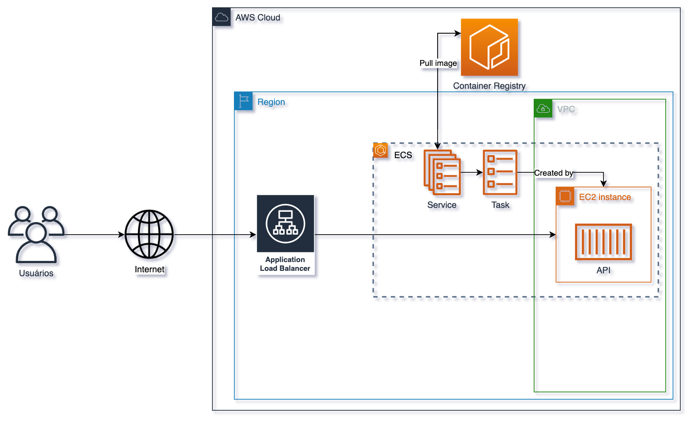

## Conteiners 7.1 - ECS-ALB-ECR - Monolito




1. No terminal do cloud9 execute o comando `cd ~/environment` para voltar a pasta principal.
2. Utilize o comando `git clone https://github.com/vamperst/ecs-container-mono-project.git` para baixar o reposítorio do exercício
3. Execute o comando `cd ecs-container-mono-project/` para entrar na pasta.
4. Para criar a infra desse exercicio execute o comando:
   ``` shell
         cfn-create-or-update \
         --region us-east-1 \
         --stack-name ecs-monolito \
         --wait \
         --template-body file://infrastructure/ecs.yml \
         --capabilities CAPABILITY_NAMED_IAM
   ``` 

5. Após a criação da stack no cloudformation é hora de fazer deploy. Vamos precisar instalar o docker para tal. Execute os comando abaixo:
``` shell
    # Install docker engine
    curl -Ssl  https://get.docker.com | sudo sh
    sudo groupadd docker
    sudo usermod -aG docker ubuntu
    # Install docker-compose
    COMPOSE_VERSION=`git ls-remote https://github.com/docker/compose | grep refs/tags | grep -oE "[0-9]+\.[0-9][0-9]+\.[0-9]+$" | sort --version-sort | tail -n 1`
    sudo sh -c "curl -L https://github.com/docker/compose/releases/download/${COMPOSE_VERSION}/docker-compose-`uname -s`-`uname -m` > /usr/local/bin/docker-compose"
    sudo chmod +x /usr/local/bin/docker-compose
    sudo sh -c "curl -L https://raw.githubusercontent.com/docker/compose/${COMPOSE_VERSION}/contrib/completion/bash/docker-compose > /etc/bash_completion.d/docker-compose"

    # Install docker-cleanup command
    cd /tmp
    git clone https://gist.github.com/76b450a0c986e576e98b.git
    cd 76b450a0c986e576e98b
    sudo mv docker-cleanup /usr/local/bin/docker-cleanup
    sudo chmod +x /usr/local/bin/docker-cleanup
    cd ~/environment/ecs-container-mono-project/
```

6. Faça o deploy utilizando o comando:
   ```
    ./deploy.sh us-east-1 ecs-monolito
   ```
7. APós a execução com sucesso espere 3 minutos e utilize o comando `aws cloudformation --region us-east-1 describe-stacks --stack-name ecs-monolito --query "Stacks[0].Outputs[?OutputKey=='Url'].OutputValue" --output text` para ter acesso a URL do serviço.
8. Utilizando a URL acesse as seguintes URLs no seu navegador:
   ```
    http://URL-COPIADA/api/users
    http://URL-COPIADA/api/threads
    http://URL-COPIADA/api/threads/1
    http://URL-COPIADA/api/
    http://URL-COPIADA/api/posts/by-user/2
   ```
9. Execute os comandos abaixo para deletar o serviço criado no ECS, caso contrario não é possivel deletar o cluster:
   ``` shell
    nomeCluster=(`aws ecs list-clusters |jq -r .clusterArns[0] | rev | cut -d/ -f1 | rev`)
    service=(`aws ecs list-services --cluster $nomeCluster | jq -r .serviceArns[0]  | rev | cut -d/ -f1 | rev `)
    aws ecs delete-service --cluster $nomeCluster --service $service --force
   ```

10. Para deletar a stack utilize o comando `aws cloudformation delete-stack --stack-name ecs-monolito`
11. Utilize os comandos abaixo para deletar os target groups criados pelo script de deploy:
    ``` shell
    arnTargetGroup=$(aws elbv2 describe-target-groups --names api  --query "TargetGroups[0].TargetGroupArn" --output text)
    aws elbv2 delete-target-group --target-group-arn $arnTargetGroup 
    ```

