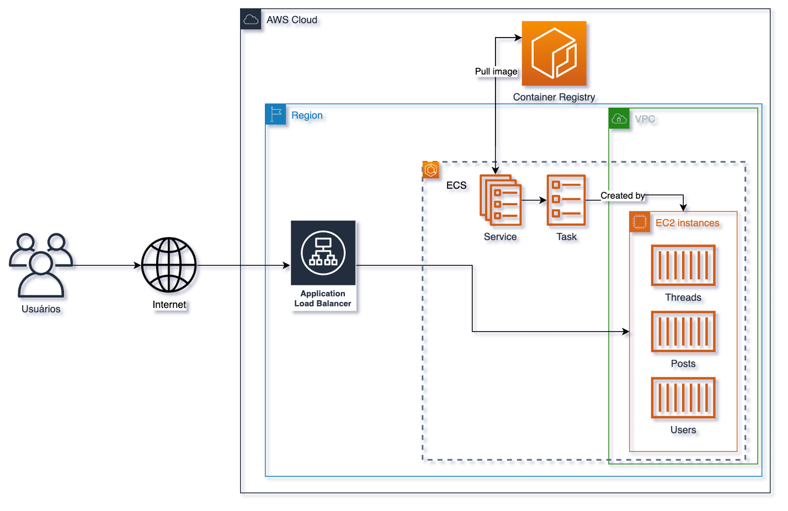

## Conteiners 7.2 - ECS-ALB-ECR - MicroServices




1. No terminal do cloud9 execute o comando `cd ~/environment` para voltar a pasta principal.
2. Utilize o comando `git clone https://github.com/vamperst/ecs-container-microservices-project.git` para baixar o reposítorio do exercício
3. Execute o comando `cd ecs-container-microservices-project/` para entrar na pasta.
4. Para criar a infra desse exercicio execute o comando:
   ``` shell
         cfn-create-or-update \
         --region us-east-1 \
         --stack-name ecs-microservices \
         --wait \
         --template-body file://infrastructure/ecs.yml \
         --capabilities CAPABILITY_NAMED_IAM
   ``` 


5. Faça o deploy utilizando o comando:
   ```
    ./deploy.sh us-east-1 ecs-microservices
   ```
6. APós a execução com sucesso espere 3 minutos e utilize o comando `aws cloudformation --region us-east-1 describe-stacks --stack-name ecs-microservices --query "Stacks[0].Outputs[?OutputKey=='Url'].OutputValue" --output text` para ter acesso a URL do serviço.
7. Utilizando a URL acesse as seguintes URLs no seu navegador:
   ```
    http://URL-COPIADA/api/users
    http://URL-COPIADA/api/threads
    http://URL-COPIADA/api/threads/1
    http://URL-COPIADA/api/
    http://URL-COPIADA/api/posts/by-user/2
   ```
8. Execute os comandos abaixo para deletar os 3 serviços criados no ECS, caso contrario não é possivel deletar o cluster:
   ``` shell
    for i in 1 2 3 ; do
        nomeCluster=(`aws ecs list-clusters |jq -r .clusterArns[0] | rev | cut -d/ -f1 | rev`)
        service=(`aws ecs list-services --cluster $nomeCluster | jq -r .serviceArns[0]  | rev | cut -d/ -f1 | rev `)
        aws ecs delete-service --cluster $nomeCluster --service $service --force
    done
   ```
9.  Para deletar a stack utilize o comando `aws cloudformation delete-stack --stack-name ecs-microservices`
10. Utilize os comandos abaixo para deletar os target groups criados pelo script de deploy:
    ``` shell
    arnTargetGroup=$(aws elbv2 describe-target-groups --names posts  --query "TargetGroups[0].TargetGroupArn" --output text)
    aws elbv2 delete-target-group --target-group-arn $arnTargetGroup 

    arnTargetGroup=$(aws elbv2 describe-target-groups --names threads  --query "TargetGroups[0].TargetGroupArn" --output text)
    aws elbv2 delete-target-group --target-group-arn $arnTargetGroup 

    arnTargetGroup=$(aws elbv2 describe-target-groups --names users --query "TargetGroups[0].TargetGroupArn" --output text)
    aws elbv2 delete-target-group --target-group-arn $arnTargetGroup 
    ```